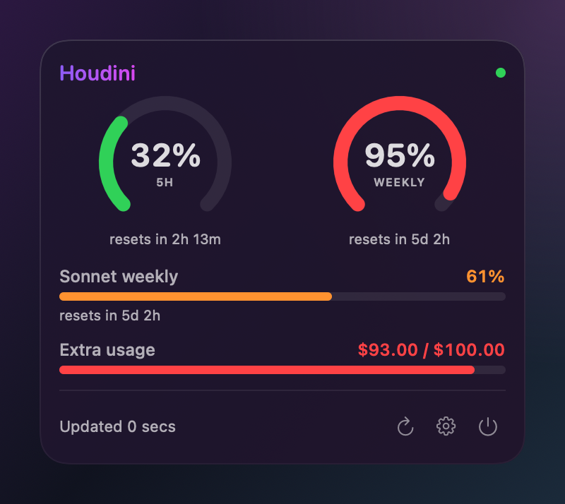

# Houdini — see your AI usage and spend, revealed

> A local-first **macOS app** that reveals your AI usage and spend — in your menu bar and on your desktop.
> Repo: [`vitorsalomao05/houdini`](https://github.com/vitorsalomao05/houdini) ·
> Site: **[houdini.salomao.org](https://houdini.salomao.org)** ·
> Target: **macOS 14+ / Apple Silicon**.

Houdini is a multi-provider platform for AI usage + cost on macOS. **Claude
(Pro/Max) is live today** — your 5-hour and weekly limits, reset timers, and
any extra-usage spend, refreshed about **every 60 seconds**. OpenAI and the
Anthropic Console are on the roadmap. No account, no server; credentials stay
in your Keychain.

<p align="center">
  
</p>

## Install (macOS 14+, Apple Silicon)

```sh
curl -fsSL https://raw.githubusercontent.com/vitorsalomao05/houdini/v1.0.0/install.sh | bash
```

Downloads the ad-hoc-signed `Houdini.app` + the `houdini` CLI from the pinned
[`v1.0.0` release](https://github.com/vitorsalomao05/houdini/releases/tag/v1.0.0),
**verifies their SHA-256** against `SHASUMS256.txt`, then installs without `sudo`
(app → `~/Applications`, CLI → `~/.local/bin`) — with no Gatekeeper prompt. It
offers (never forces) launch at login, and is safe to re-run. The desktop widget
ships inside the app (toggle it in Settings) — no separate install. Read it
first — it's at [`install.sh`](install.sh).

Houdini is **one app** with two co-equal, user-facing features (the website brands
neither separately — see ADR-010/011):

1. **Menu bar** — your tightest limit, always visible; popover with every window. True 60s refresh.
2. **Desktop widget** — the same gauges on your wallpaper, as a draggable, resizable glass panel.
   **Native to the app** (SwiftUI in an `NSPanel`) — toggle it in Settings, no separate install. True 60s refresh.

A glanceable **Notification Center widget** (WidgetKit) is a *deferred* future surface — never
built, and hard-blocked under the current distribution (ADR-013); Apple would cap its refresh
at ~15 min anyway (ADR-002), so it is not advertised on the site.

## Update

Keep Houdini current with the built-in updater. `houdini update` re-runs the same
verified, SHA-256-checked `install.sh` path (no `sudo`, no Gatekeeper prompt,
launch-at-login left exactly as you set it), then reports the new version:

```sh
houdini update            # update to the latest release
houdini update --check    # dry-run: show installed vs. latest, change nothing
houdini update 0.5.0      # install a specific release (incl. rollback to an older one)
```

It updates only what it installed — `~/Applications/Houdini.app` and
`~/.local/bin/houdini` — reads no credential, and rolls back to your current version if
anything fails. If Houdini is running, quit and relaunch it (menu bar ▸ Quit) to load the
new version.

## The core idea (read this first)

The naive approach is "open a logged-in page in a background browser, reload every minute, scrape the number." We researched this and found a **much better path**: most AI usage numbers are backed by a **JSON endpoint**, not just rendered HTML. So instead of driving a browser, Houdini reads the user's existing credential (Keychain OAuth token or session cookie) and calls the JSON endpoint directly. This is lighter (~6 MB native vs hundreds of MB of bundled Chromium), more robust (no DOM breakage), and far easier to sign/notarize.

The background-browser scrape survives only as a **last-resort fallback adapter** for providers that genuinely have no readable endpoint.

## Providers

| Provider | Source | Method | Status |
|---|---|---|---|
| **Claude (Pro/Max)** | `api.anthropic.com/api/oauth/usage` (Claude Code OAuth token in Keychain) **or** `claude.ai/api/organizations/{org}/usage` (session cookie) | JSON | **Live** |
| **OpenAI Platform** (API usage/cost) | `/v1/organization/usage/*`, `/v1/organization/costs` | JSON (admin key) | Planned |
| **Anthropic Console** (API usage/cost) | Admin API `usage_report` / `cost_report` | JSON (admin key) | Planned |

See [`PROVIDERS.md`](PROVIDERS.md) for the full adapter contract and per-provider specs (including the experimental ChatGPT-Plus path), [`ARCHITECTURE.md`](ARCHITECTURE.md) for the system design, [`DECISIONS.md`](DECISIONS.md) for the ADRs, and [`ROADMAP.md`](ROADMAP.md) for the phased plan.

## Repo layout

```
houdini/
├── README.md            ← this file
├── ARCHITECTURE.md      ← system design + diagram
├── DECISIONS.md         ← ADRs (why menu bar, why no 60s widget, the rebrand…)
├── PROVIDERS.md         ← provider-adapter contract + per-provider specs
├── ROADMAP.md           ← phased plan
├── RELEASE.md           ← release checklist + per-release go-live records
├── CLAUDE.md            ← operating guide for Claude Code (how we work here)
├── CONTEXT.md           ← product context (why) — pairs with BACKLOG.md (what's next)
├── BACKLOG.md           ← prioritized work queue
├── core/                ← FetcherCore Swift package (shared data layer) + `houdini` CLI
├── apps/
│   ├── menubar/         ← SwiftUI menu bar app + native desktop widget (flagship)
│   └── ios/             ← native iOS app + widget scaffold (cookie auth; not yet built — ADR-008)
├── site/                ← Astro + Tailwind landing page (deploys via Vercel)
├── install.sh           ← one-liner installer (verified download from Releases)
├── scripts/             ← developer bootstrap (`init.sh`) — release CI lives in .github/workflows/
├── conductor/           ← Build Conductor artifacts (tracked audits; local-only prompts)
└── audit/               ← v1 audit corpus (charter, diagnosis, plan)
```

New here? Run [`scripts/init.sh`](scripts/init.sh) to verify your toolchain and print the
repo map, the real build/test/run commands, and the current top backlog item.

## Privacy posture

Credentials never leave the device. Tokens/cookies live in the macOS Keychain. No Houdini server ever sees them — there is none. Requests go straight from your Mac to each provider's own endpoint. The landing site has a dedicated trust/privacy section because the app touches logins.

## Uninstall

Houdini installs to two paths in your home folder and — only if you signed in to
claude.ai in-app — keeps one session in your Keychain. To remove all of it, quit
Houdini (menu bar ▸ Quit), then:

```sh
# If you enabled launch-at-login, unregister it first:
"$HOME/Applications/Houdini.app/Contents/MacOS/Houdini" --unregister-login-item

# Remove the app and the CLI:
rm -rf "$HOME/Applications/Houdini.app"
rm -f  "$HOME/.local/bin/houdini"

# Remove Houdini's saved preferences:
defaults delete org.salomao.houdini 2>/dev/null || true

# Remove the claude.ai session Houdini stored (only exists if you used the
# cookie sign-in). The Claude Code OAuth token is Claude Code's own — left alone:
security delete-generic-password -s Houdini-claude-session 2>/dev/null || true
```

That's everything Houdini owns. It never touches your Claude Code credential
(`Claude Code-credentials`), `~/.claude/`, or any provider data.

## License

Free and open source under the [MIT License](LICENSE).
