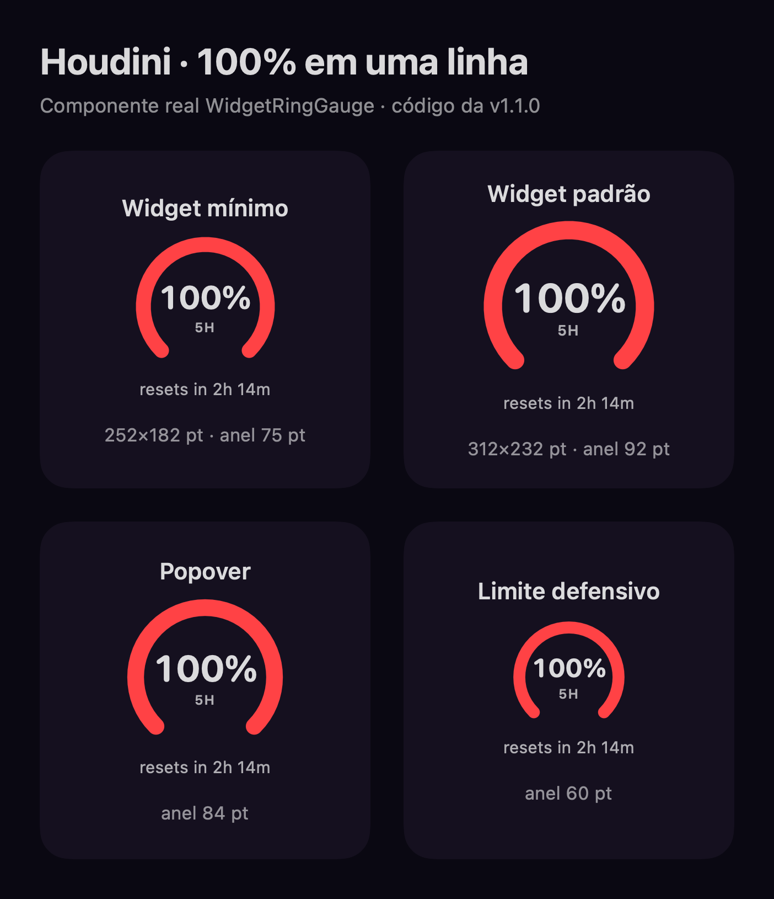

# Production review — 2026-09-21

## Scope and preserved work

The current product release is v1.1.0. The original checkout remains on
`feat/release-contract-3`, with its staged and unstaged changes preserved. This
review uses a separate checkout based on `e9d3770`.

GitHub issues #3 and #4 explicitly pause their WIPs; #1, #6 and #8 are deferred,
and #5 awaits retriage. None was silently resumed. Issue #2 was closed after
the visual check below; the repository description was updated to Claude/Codex
and no longer promises unimplemented providers. The prior accepted limitation
on a fresh live Claude account/usage round trip remains recorded in
[subscription validation](subscription-connections-2026-09-20.md).

## Production incident and repair

The browser and independent HTTP requests found `/` and `/install` returning
Vercel's plain-text `404 NOT_FOUND`, despite deployment status Ready.

```text
curl --fail --silent --show-error https://houdini.salomao.org/ -o /tmp/houdini-production-home.html
curl: (56) The requested URL returned error: 404
```

Deployment `dpl_6VdJGWdB9dpsPaBcSjPXSATtoXJJ` was created by the automatic Git
integration for the release-record commit `e9d3770`. The Vercel project had
`rootDirectory: null` and `framework: null`; build/install/output overrides were
also null. Its log showed a 202 ms build and no Astro invocation. It superseded
the verified prebuilt production deployment nine minutes after publication.

Promoting retained deployment `dpl_9WrAHv8fBeUfa1nxxXrZSjkWsAzk` restored HTTP 200
and current v1.1.0 installation pointers. The same failing curl then exited 0.
The project configuration was corrected and read back from the API:

```json
{
  "rootDirectory": "site",
  "framework": "astro",
  "installCommand": "npm ci",
  "buildCommand": "npm run build",
  "outputDirectory": "dist"
}
```

The repository also pins framework/install/build/output in `site/vercel.json`.
Root Directory is a Vercel project setting; the repository file alone cannot
correct it. CLI instructions now start from the repository root, so Vercel can
apply `site` once. Git pushes to `master` must be checked after their deployment,
including documentation-only pushes. The public regression gate is
`python3 scripts/verify_site.py`.

Independent review found that the initial checker could accept the homepage at
`/install`. The gate now requires each route's canonical identity and the guided
installer marker. The final verifier passed **76/76** public checks. Its three
HTTP regression cases use the real Astro output: valid deployment passes, empty
404 output fails, and homepage served at `/install` fails. All three pass in the
local unittest suite, which also runs after the site build in CI.

## App artifact evidence

Downloaded the three assets from the current public, non-prerelease, immutable
GitHub Latest release. The publisher source is
`267ea5166f66c3e02b29a4196259599e48400f32`; the older local tag reference was not
used as source evidence and was left untouched.

- App archive SHA-256:
  `b122e6640ea73a60d0b816598c50c1e41ad2ce4c03920ff3dad1701a4d9b0238`.
- CLI SHA-256:
  `8f5e977f9b40fbb441aab3af929e9e89bc7862dd29b5ec35f2bf59b8f27f18ab`.
- Manifest SHA-256:
  `2c579fefb9b6e099e79ed238565e5265d1045c0b07eded81d8aff0b8a7d94870`.
- Checksums match both the release API and `SHASUMS256.txt` entries.
- App 1.1.0 / build 7; CLI 1.1.0; both arm64. Code signatures pass; app is
  ad-hoc signed with hardened runtime, not notarized.
- Downloaded app passed metric 10/10, authentication 26/26 and widget 11/11 checks.
  Widget validation required actual display access; a sandbox-aborted attempt
  was not counted as a pass. Tests use fake credentials and isolated preferences.
- [Publisher](https://github.com/vitorsalomao05/houdini/actions/runs/35547764661)
  and [tag CI](https://github.com/vitorsalomao05/houdini/actions/runs/35547764697)
  succeeded on that exact source: 103 core tests / 11 suites and 88 selftest
  checks, plus the app suites above. Tag CI also built the static site and the
  iOS Simulator library. No replacement app binaries or tag were needed.

No installed app, login item or real provider credential was changed in this
review. The public pinned installer was downloaded without executing it.

## Website and issue verification

The restored deployment passed the initial 66 HTTP checks: seven current routes,
version and installer pointers, branded 404s, responsive product images, CSS/JS,
OG image, robots and sitemaps. The legacy domain returned 308 to the correct
production paths for `/` and `/install`.

Browser verification reached the guided installer through internal navigation;
Next/Back worked, selecting Codex showed its instructions, and keyboard Enter
activated Back. The focus outline was visible (2 px), and the 390 px viewport
had no horizontal overflow. This is targeted production smoke verification,
not a claim of a new complete accessibility audit.

For issue #2, the real `WidgetRingGauge` source was rendered in an isolated
SwiftUI harness with sample 100% usage: 75 pt (minimum widget), 92 pt (standard
widget), 84 pt (popover), and 60 pt (defensive minimum). Every value remains on
one line without clipping. This verifies the isolated shared component at the
actual dimensions, not a fresh account reading or full-window screenshot.



## Remaining maintenance

The nine affected npm packages are tracked in `BACKLOG.md`. The static site has
no public optimizer/server endpoint and builds two trusted local PNGs. The
[Astro critical advisory](https://github.com/withastro/astro/security/advisories/GHSA-26w7-cxv4-gfx2)
and [Sharp advisory](https://github.com/lovell/sharp/security/advisories/GHSA-rgj7-g3m4-5g8c)
concern untrusted image processing. CI/development remain conditionally exposed;
a reviewed dependency/framework upgrade is still required. Other parser
advisories were not individually reproduced. Dependencies were not upgraded as
part of this deployment repair.
